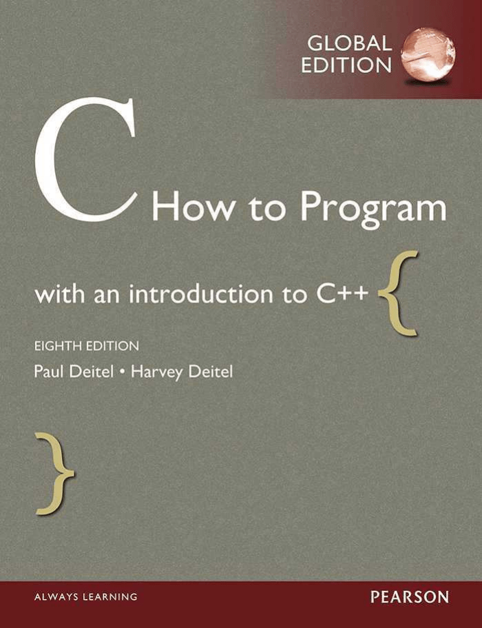
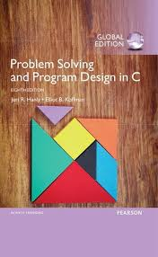
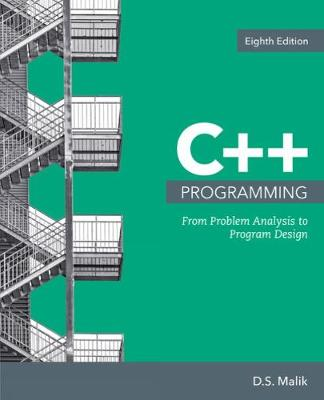
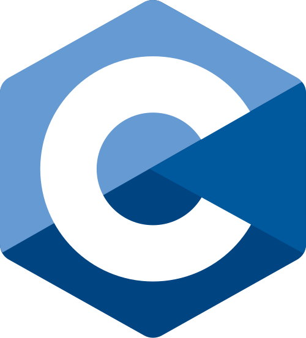

# 11103: Structure of Programming

    

        <button id="btn-c" class="lang-toggle-btn active">C</button>
        <button id="btn-cpp" class="lang-toggle-btn">C++</button>
    

Toggle between C and C++ to instantly translate all code examples, syntax guides, and worksheet solutions across the site. Your preference is saved automatically.

## Table of contents
{: .no_toc .text-delta }

1. TOC
{:toc}

---

## Course Overview

Welcome! This course is designed to take you from the basics of code to a deep understanding of how programs work. As you solve problems week by week, you will build the critical thinking skills necessary for advanced fields like software engineering and system design. In short, this course is where you stop just using software and start understanding how to build it.
## Prerequisites

Zero prior experience is expected. Success in this course relies on three things: your curiosity to learn new systems, your consistency in practicing the material, and your perseverance in solving complex problems. Bring your focus, and we will handle the rest.

## Textbook

We will use the following textbook. We will also use slides, notes, and other resources as necessary.

    <strong>C: How to Program</strong>, by Deitel and Deitel, Prentice Hall, 8th Edition (or later).

## References

  <strong>Problem Solving and Program Design in C</strong>, Latest Edition, Jeri R. Hanly, and Elliot B. Koffman.

  <strong>C++ Programming: From Problem Analysis to Program Design</strong>, Latest edition, DS Malik.

## Course Topics

The first few weeks will focus on the fundamentals of CC++ programming, including memory concepts, arithmetic, functions, selection statements, loops, and arrays. Each of the remaining weeks will explore advanced topics such as sorting, 2D arrays, recursion, and pointers. Here is what you should expect to achieve by the end of the course:

- Be able to **analyze and solve** computational problems using core CC++ programming concepts including variables, control structures, and functions.
- Be able to **implement and manipulate** data structures such as 1D/2D arrays and strings for data processing.
- Be able to **apply advanced techniques** including recursion and pointers to write efficient and modular code.
- Be able to **design and debug** complete CC++ programs using modern development tools.

## Tools

  <strong>C</strong> 
  We will learn programming in C!

  <strong>C++</strong> 
  We will learn programming in C++!

  <strong>Code::Blocks</strong> 
  This is the IDE (Integrated Development Environment) you will use for programming in CC++. While you are allowed to use other IDEs, this is the one we will use in the classroom, base the course material on, and provide support for. [<a href='https://www.codeblocks.org/downloads/'>download</a>]
  [<a href='https://www.youtube.com/watch?v=S9NhsWepfOM'>Installation Guide</a>]

